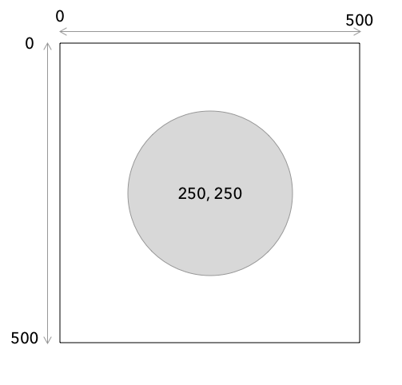
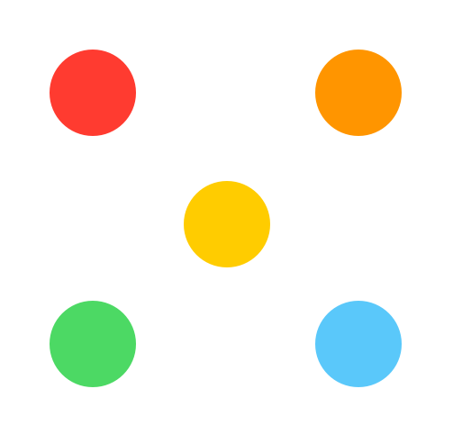

# Getting started with Pygame

To run pygame you'll need to install its dependencies. 

## Learning Objectives

- Use Pygame
- Describe Pygame
- Use tuples to describe screen coordinates
- Use tuples to define RGB colors
- Describe colors with RGB color model

## Get started with pygame 

To use pygame you have to install it. Pip is python's package manager. Install that first if you haven't already. 

```
pip install pygame
```

## Try some of the sample games

Run these commands in the terminal to try the sample games:

- `python3 -m pygame.examples.aliens`
- `python3 -m pygame.examples.stars`
- `python3 -m pygame.examples.chimp`
- `python3 -m pygame.examples.moveit`
- `python3 -m pygame.examples.fonty`
- `python3 -m pygame.examples.freetype_misc`
- `python3 -m pygame.examples.vgrade`
- `python3 -m pygame.examples.eventlist`
- `python3 -m pygame.examples.sound`
- `python3 -m pygame.examples.sound_array_demos`
- `python3 -m pygame.examples.liquid`

These are demos of pygame and its features you can find the source code for these demos here: https://www.pygame.org/docs/ref/examples.html

## Pygame Hello World

Pygame is all about drawing things on a 2d surface. The process requires that you write code and understand the concepts that underlay pygame. These concepts are also part of many other platforms so the ideas here are transferable though the language will change. 

Create a new file: `game.py`

Add the following: 

```python
# Import and initialize pygame
import pygame 
pygame.init()
```

This imports `pygame` and initializes `pygame`. 

Next, configure the screen size. 

```python
# Configure the screen
screen = pygame.display.set_mode([500, 500])
```

Notice we define a variable `screen` you'll use this to draw your game into the game window. 

Here you are calling `pygame.display.set_mode()` and including the dimensions of the screen. You need to include the width and height of the screen. You can include these as a tuple or a list. This call returns a screen object. 

Last, you'll create a game loop. This is loop runs each time the game screen is updated. Typically this is 30 to 60 times per second. 

```python
# Creat the game loop
running = True 
while running: 
	# Looks at events 
	for event in pygame.event.get():
		if event.type == pygame.QUIT:
			running = False
	
	# Clear the screen
	screen.fill((255, 255, 255))
	# Draw a circle
	color = (255, 0, 255)
	position = (250, 250)
	pygame.draw.circle(screen, color, position, 75)
	# Update the display
	pygame.display.flip()
```

The while loop runs as long as `running` is `True`. 

Two things are happening in the loop. First, we check for any game events. You'll use this to check for keyboard, joystick, and other game events. Here we are only checking if the game has quit. This will happen if you close the game window. 

Second, we draw our game to the window. Here we fill the window with white, then draw a circle in the center. 

Look closely at `screen.fill( (255, 255, 255) )`. This function takes a color value expressed as a tuple `(255, 255, 255)`. 

Notice the `colors` is assigned a tuple also. This is used to set the color of the circle. 

Take a look at the `position` variable. This is also assigned a tuple but with two values. The first number is the x and the second is the y position. 

The next line: `pygame.draw.circle(screen, color, position, 75)` draws a circle filled with the color, at the position, with a radius of 75 pixels. 

The last line `pygame.display.flip()` tells pygame to update the screen. 

From here the game loop starts over again and draws the game again. 

### Colors

**Colors** are expressed with three values representing their Red, Green, and Blue components. Each component can have a value of 0 to 255. 

Try these colors to get an idea of how the components interact: 

- `(255, 0, 0)` - Red has no Green or Blue
- `(0, 255, 0)` - Green has no Red or Blue
- `(0, 0, 255)` - Blue has no Red or Green

These are the primary colors of the RGB color model. 

Try these colors: 

- `(255, 255, 0)` - Yellow is all Red and Green and no Blue
- `(0, 255, 255)` - Cyan is Green and Blue with no Red
- `(255, 0, 255)` - Fuschia has no Green. 

These are the secondary colors of the RGB color model. 

256 is 2^8 and 256^3 16,777,216 possible colors. You can make any of these 16 million colors by varying the amount of Red, Green, and Blue. 

Try some of these colors: 

- `(255, 255, 255)` - We get white when all of the values are 255
- `(0, 0, 0)` - We get black when all of the values are 0
- `(100, 100, 100)` - If all of the values are equal we get gray
- `(250, 141, 7)` - A nice shade of orange. 
- `(25, 184, 22)` - A nice shade of green. 
- `(20, 121, 199)` - A nice shade of green. 

Try the color picker to generate RGB values for colors: https://www.google.com/search?client=safari&rls=en&q=rgb+color+picker&ie=UTF-8&oe=UTF-8

### Positions

You'll use x and y coordinated to position things in the pygame window. 



x values start on the left with numbers increasing to the right. Try these: 

- `position = (250, 250)` - Puts the circle in the center. 
- `position = (0, 250)` - Places the circle at the left edge. Since the ` pygame.draw.circle()` method draws from the center the circle is half off the screen and its center is at the left edge. 
- `position = (0, 0)` - Place the center of the circle at the top left corner. 
left edge. 
- `position = (400, 300)` - Place the circle near the lower right. 

## Challenges

Notice the drawing process happens between these lines: 

```python
# Clear the screen
screen.fill((255, 255, 255))

# Your drawing here


# Update the display
pygame.display.flip()
```
You will add code between the two lines here. 

**Challenge 1** 

Try to recreate this picture. Approximate the colors are close as you can. 



**Challenge 2** 

Here there are enough circles where a loop might help you! Imagine the circle in the upper left is 1 and the top row is 1, 2, 3, and the next row is 4, 5, 6, and the last row is 7, 8, 9.


Place the circles on a grid and give each a dark gray color. 

There are two approaches you can use: 

- Loop within a loop. The first loop counts the three rows. Within that loop add another loop that counts three columns. 
- A single loop counting from 0 to 8. Generate the row and column numbers mathematically. Using the count divide by three and round down. For the column number use modulus %. This operator returns the whole number remainder. For example x % 3 will return numbers 0 to 3 for any value of x. 

