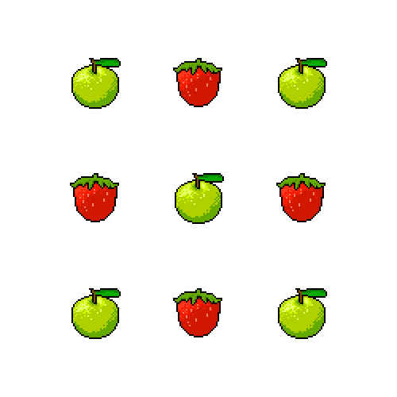

# Drawing Objects 

Shapes are great but you will also want to draw images from files. 

## Learning Objectives 

- Using images in pygame
- subclassing pygame's Sprite
- Creating new classes from existing base classes

## Getting started 

Start with the code here. This is the same as the previous example without drawing any shapes. It should open a blank pygame window: 

```python
# Example 2

# Import and initialize pygame
import pygame
pygame.init()
# Configure the screen
screen = pygame.display.set_mode([500, 500])
# Creat the game loop
running = True
while running:
  # Looks at events
  for event in pygame.event.get():
    if event.type == pygame.QUIT:
      running = False
      
  # Draw a circle
  screen.fill((255, 255, 255))
  # Update the window
  pygame.display.flip()
```

## Drawing on a surface

Pygame has a special class for drawing rectangular areas in the pygame window called Surface. Everything is a rectangle. Even a circle fits in a rectangle. Rectangles are so common they get their class! 

last time we drew directly to pygame's window. This time we're going to create a surface and draw to that surface object. The surface will appear in the pygame window. 

Create a surface: 

```python
# Configure the screen
screen = pygame.display.set_mode([500, 500])

# Create a new instance of Surface
surf = pygame.Surface((50, 50))
surf.fill((255, 111, 33))
```

Inside your game loop "blit" your surface. Blitting is the process of copying a block of pixels onto another block of pixels. In this case, you're copying the pixels in the surface onto the pixels of the pygame window. 

```python
# Clear screen
screen.fill((255, 255, 255))
# Draw the surface
screen.blit(surf, (100, 120))
```

When you call `screen.blit()` you supply two parameters: a surface, and a position. The position is a tuple with x and y. Try changing the numbers. 

What we have here is more or less what we had before. Why use a surface? Using a surface we display more than just rectangles and circles. A surface can also display image files. 

Also, we can create game objects that own a surface that will display their image in the game window! 

This is important because it is also showing us how pygame breaks its functionality into classes! `Surface` is an important class! 

## Sprites

Sprite is a term used to describe game objects. Usually, a Sprite is a game element that manifests itself on the screen. 

Pygame has a Sprite class! The Sprite class has properties and methods to help us organize our code. The Sprite class is an abstract class. An abstract class is a class you shouldn't make an instance of it directly, instead, you'll want to extend it! 

Delete the `surf` code you created in the last step. In this step, you will recreate this as a Class. 

Make a Game Object class that draws a rectangle. 

```python
class GameObject(pygame.sprite.Sprite):
  def __init__(self, x, y, width, height):
    super(GameObject, self).__init__()
    self.surf = pygame.Surface((width, height))
    self.surf.fill((255, 0, 255))
    self.rect = self.surf.get_rect()
    self.x = x
    self.y = y

  def render(self, screen):
    screen.blit(self.surf, (self.x, self.y))
```

This class extends `pygame.sprite.Sprite`. 

Defines four parameters: `x`, `y`, `width`, and `height`.

It stores three attributes: `self.surf`, `self.x`, and `self.y`.

Defines one method: `render()`. This method is responsible for drawing the GameObject's surface to the screen. It defines the screen to draw on as a parameter. Notice it draws it's surface at it's x and y! 

Create an instance of GameObject and display it. Add the following outside the game loop: 

```python
# Make an instance of GameObject
box = GameObject(120, 300, 50, 50)
```

Inside the game loop render `box` before you update the window: 

```python
# Clear screen
screen.fill((255, 255, 255))
# Draw box
box.render(screen)
# Update the window
pygame.display.flip()
```

Notice we pass the screen into `render()`! This how GameObject knows where to draw. Screen is a dependency! 

Further reading:

- https://www.pygame.org/docs/ref/sprite.html
- https://www.pygame.org/docs/ref/rect.html
- https://www.pygame.org/docs/ref/surface.html

## Displaying an image

Circles and squares are okay but the best games have rich and interesting graphics that spark our imaginations! While simple shapes can be compelling pictures open a world of possibilities. 

Here's a picture of an apple. This image is 64 by 64 pixels. 


Save this image to same folder as your python file.

Pygame has a `image.load()` method that returns a `Surface` instance! Which you can use to display the image. 

Modify the `GameObject` class:

```python
# Game Object
class GameObject(pygame.sprite.Sprite):
  # Remove width and height and add image here!
  def __init__(self, x, y, image):
    super(GameObject, self).__init__()
    # self.surf = pygame.Surface((width, height)) REMOVE!
    # self.surf.fill((255, 0, 255)) REMOVE!
    self.surf = pygame.image.load(image) # ADD!
    self.x = x
    self.y = y

  def render(self, screen):
    screen.blit(self.surf, (self.x, self.y))
```

Remove the `box` instance and create an `apple`. 

```python
# Make an instance of GameObject
# box = GameObject(120, 300, 50, 50) REMOVE!
apple = GameObject(120, 300, 'apple.png') # ADD!
```

In your game loop render the apple. 

```python
# box.render(screen) REMOVE!
apple.render(screen) # ADD!
```

This should draw the apple to the screen.

## Challenges 

**Challenge 1**

Create a second instance of GameObject. Use this image of a Strawberry: 


**Challenge 2**

Recreate this image. You'll need to make 4 apples and 5 strawberries. 



You should make an instance for each. Then render those instances in the game loop. 

