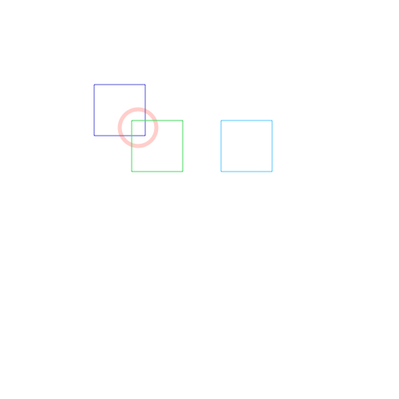
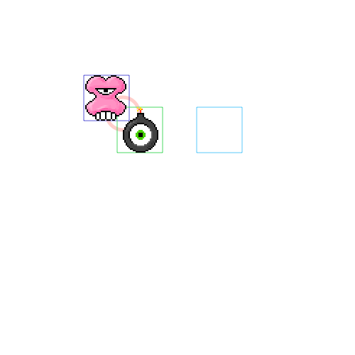

# Collisions

To create some challenges we can check if the player collides with fruits or bombs. Colliding with a bomb might end the game, colliding with fruit might score some points!

## Learning Objectives 

- Use the Rect class
- Describe rectangles and coordinates
- Use pygame's collision methods
- Calculate collisions between a Sprite and a Groups
- Calculate collisions between sprites

## Working with Collisions and Rectangles

Collisions are a difficult subject to tackle. Pygame provides a few helper methods. 

Simple collisions compare the rectangles of two objects. `Rect` is a built-in pygame class! 

- https://www.pygame.org/docs/ref/rect.html

`Rect` tracks a rectangular area. A react has an x, y, width, and height. With these values, a rect can map any rectangular shape onto the screen. 

The built-in collision helper methods use rectangles to determine if shapes collide. 



In the image, the purple and green rectangles are colliding because they overlap. The blue rectangle does not collide. 

The math processing of this type of collision is efficient but visually it's imperfect. 



In this image, you can see that the rectangles overlap but the images don't appear to be touching. 

For now, this will work for us later we can improve collisions to make them more accurate. 

Collisions Rely on each object defining a rect attribute, this means GameObjects need to define a `rect` attribute that the collision methods can use. 

The `Rect` is an object with properties! Not only does it define the area of a sprite it also defines the location. Since our sprites are moving we need to update the `rect` each time they move. 

Modify your `GameObject`:

```python
# Game Object
class GameObject(pygame.sprite.Sprite):
	def __init__(self, x, y, image):
		super(GameObject, self).__init__()
		self.surf = pygame.image.load(image)
		self.x = x
		self.y = y
		self.rect = self.surf.get_rect() # add 

	def render(self, screen):
		self.rect.x = self.x # add
		self.rect.y = self.y # add
		screen.blit(self.surf, (self.x, self.y))
```

Here you added a new property `self.rect` and set it to the `self.surf.get_rect()`. The `get_rect()` method returns a `Rect` object with the dimensions of the `Surface`.

In the render method, you added two lines that update the `x` and `y` of `self.rect` each time the `GameObject` is rendered. Since the Game Objects are moving this should update the rectangle position and keep it in sync with the position of the game object. 


## Handling Collisions with Group

Pygame has many collision methods. These can detect collisions between all sprites in a group. In our case, for now, we are concerned with collisions between Fruit and the player. 

### Group the Fruit

So far we have three types of sprites: Player, Fruit (Apple and Strawberry), and Bomb. For this step, we only want to detect a collision between players and fruit. 

To do this make a group for Fruit. Add a new group for the fruit. Don't remove the `all_sprites` group since we will still use this to track all of the sprites. 

```python
# make a fruits Group
fruit_sprites = pygame.sprite.Group()
```

Now add all of the fruit to the `frui_sprites` group:

```python
fruit_sprites.add(apple)
fruit_sprites.add(strawberry)
```

### Check collisions fruit and player

In your game loop after you move and render all of your sprites check for collisions. 

```python
# Check Colisions
fruit = pygame.sprite.spritecollideany(player, fruit_sprites)
if fruit:
	fruit.reset()
```

The `pygame.sprite.spritecollideany()` method takes two parameters. The first is a sprite. Here pass `player`. The second parameter is a Group of sprites, here we passed `fruit_sprites`.

This method returns a sprite from the group that has collided with the test sprite. Note! the `spritecollideany()` method only returns a single sprite. 

In this example `fruit` is either `None`, no collision occurred, or it returns one of the fruit from the group that player has collided with. 

Last, if `collision` is `None` we call `fruit.reset()` and the collided fruit is reset and starts over again. 

### Collide with a bomb

The last step is to check for a collision between the player and the bomb. These are just two sprites. We could put them in a group but there is only one of each so it's just as much work to just check for a collision between the two. 

For this you can use `pygame.sprite.collide_rect()`. This method takes two sprites as arguments and returns a Bool. If it returns True the sprite's rectangles overlap. 

Add the following to the game loop: 

```python
# Check collision player and bomb
if pygame.sprite.collide_rect(player, bomb):
	running = False
```

## Challenges

**Challenge 1**

The game plays pretty evenly throughout. It's fairly easy. Make the objects get faster over time. The Fruit and Bombs all calculate and hold their speed in their `self.dx` or `self.dy`, depending on the direction they are moving. 

Your goal is to make this number get fast each time the player captures a fruit. 

**Challenge 2**

Reset the whole game when the player hits the bomb. This means you'll need to reset the fruits, bomb, and player.